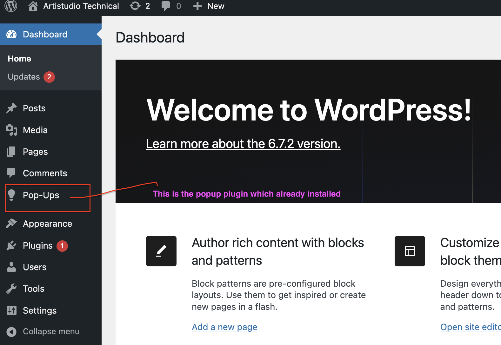

# Wp Popup Plugin

Requires at least: 4.5
Tested up to: 6.7.2
Requires PHP: 5.6
Stable tag: 0.1.0
License: GPLv2 or later
License URI: https://www.gnu.org/licenses/gpl-2.0.html

# Description

The plugin should seamlessly display pop-up content on a WordPress website page when triggered appropriately based on the popup settings.

# Installation

1. Clone the popup plugin from Github repository
2. Copy the file to Wordpress directory `wp-content/plugins`
3. Open terminal, pointing enter directory `wp-content/plugins`
4. Run command: `npm install` to install the package.
3. Go to WP admin and login.
4. Activate the plugin through the 'Plugins' menu in WordPress
4. After login, you will see the Pop-Ups added in the side menu.

5. Click Pop-Ups to create new popup CPT.

# How to create Popup

1. Click Pop-Ups to create new popup CPT.
2. Click `Add New Post` button

3. In the Pop-Up Details form, fill in the title and description

4. Lastly, select a page from the dropdown list (page selection to determine in which page the popup will be shown)
5. Then click `Publish` button.

# To test the popup

Go to the selected page and once landed you will see the popup as seen as below:

